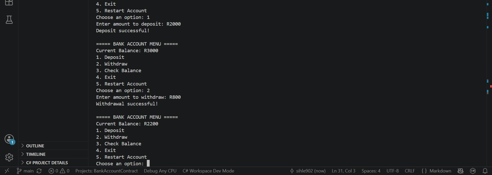

# BankAccountContract

A C# console application that demonstrates the **Design by Contract (DbC)** principle by implementing a bank account system with preconditions, postconditions, and invariants.

## Project Overview

This project demonstrates how software contracts can be used to ensure that methods behave correctly. The `BankAccount` class applies rules that control how deposits, withdrawals, and account balances are managed.

## Features

- Create a bank account
- Deposit money
- Withdraw money
- Check account balance
- Validate account rules
- Apply Design by Contract principles

## Design by Contract Implementation

### Preconditions
Conditions that must be true before a method executes:

- Deposit amount must be greater than zero
- Withdrawal amount must be positive
- Withdrawal amount cannot exceed the account balance

### Postconditions
Conditions that must be true after a method completes:

- Account balance updates after a successful transaction

### Invariants
Rules that must always remain true:

- Account balance cannot become negative

## Technologies

- C#
- .NET Console Application
- Visual Studio Code
- Git & GitHub

## How to Run

Clone the repository:

```bash
git clone https://github.com/sihle902/BankAccountContract.git

Navigate into the project folder:
```bash
cd BankAccountContract
```
Run the application:
```bash
dotnet run
```
## Application Demo

Screenshot showing the BankAccount console application running successfully.



## Application Screenshots

### Savings Account
